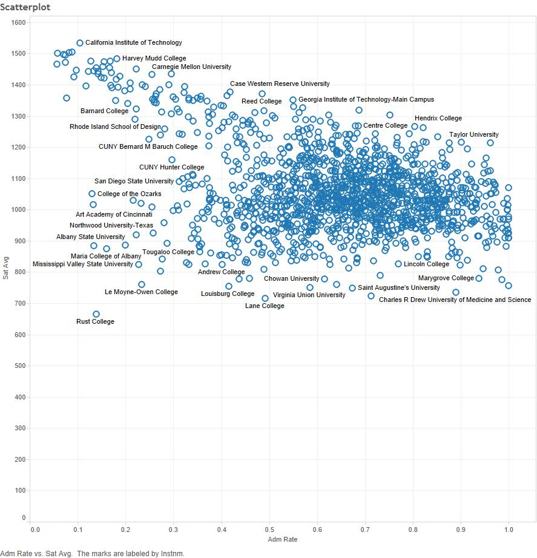
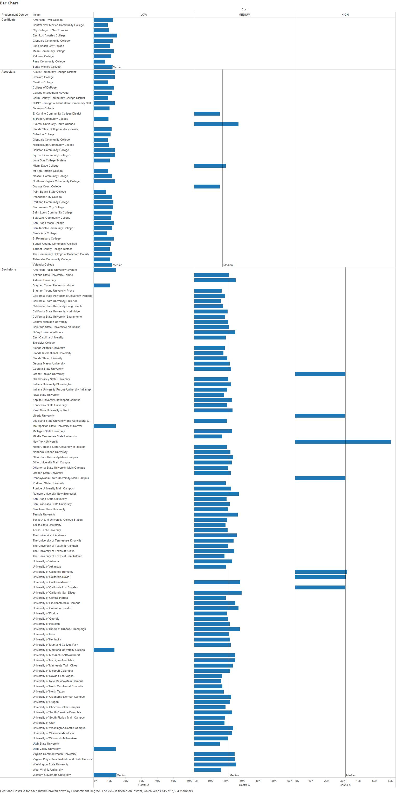
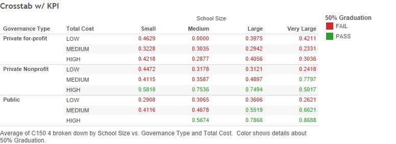

This is an html file that documents the steps to reproduce our project . This html file presents a visual story about our data and what we discovered about our data using visualization and workflow techniques.

The first thing we did was locate a source of data. We used...

***

First image:

***
For our second analysis, we looked at the cost of persuing different degrees at schools with 20,000 students or more. In this bar chart, colleges are grouped according to the most popular degree type from that university and by their cost. "Low"" cost colleges cost less than $15,000/year, (including tuition, books, and living expenses), "medium" cost less than $30,000, and "high" cost more than $30,000. A reference line shows the median cost for each category.
Second image:

***

Third image:
